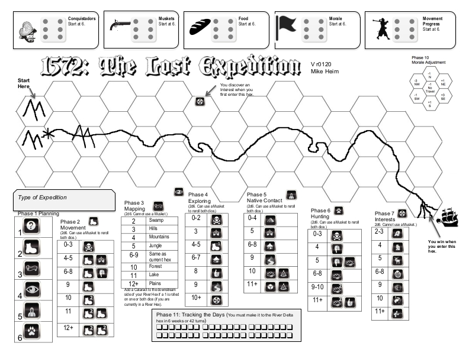

# exp1572
Game "1572: The Lost Expedition" (designed by [Mike Heim](https://boardgamegeek.com/boardgamedesigner/87601/mike-heim)).

Console game manager written in python. See full description at [BoardGameGeek](https://boardgamegeek.com/boardgame/199269/1572-lost-expedition).



## Installation

```bash
pip install exp1572
```

## Run

```bash
exp1572
```

Available localizations: ru, en (work continues)
